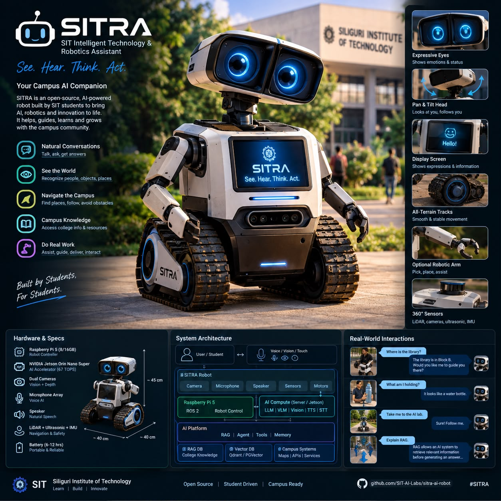

🤖 SITRA — SIT Intelligent Technology & Robotics Assistant

See. Hear. Think. Act.

SITRA is an open-source AI-powered autonomous campus robot being designed and built by students at Siliguri Institute of Technology (SIT).

The project combines Artificial Intelligence, Robotics, Computer Vision, Speech AI, Large Language Models, RAG, Agentic AI, Embedded Systems, and Autonomous Navigation into a single physical platform.

SITRA is not intended to be just a robot.

It is a living AI learning platform where students can learn modern AI and robotics by building, deploying, testing, and improving a real machine that operates on campus.

⸻

🎯 Vision

Build an approachable campus robot that can:

* 👁️ See and understand its environment
* 👂 Hear and understand human speech
* 🧠 Reason using open-source AI models
* 📚 Answer questions using college knowledge
* 🗣️ Hold natural conversations
* 🧭 Navigate autonomously
* 🚶 Follow people
* 🤖 Perform physical actions
* 🛠️ Execute AI-driven tools
* 📊 Learn from experiments and telemetry
* 🔒 Operate locally wherever possible

The long-term goal is to create an open-source student robotics platform that can be continuously developed by future SIT students.

⸻

✨ Project Highlights

🧠 Generative AI

* Local/open-source LLMs
* Streaming inference
* Tool calling
* Structured outputs
* Agent orchestration
* Context management
* Model routing

👁️ Computer Vision

* Object detection
* Person detection
* Object tracking
* Visual perception
* Camera streaming
* Visual navigation
* Optional Vision-Language Models

🎤 Voice AI

* Wake-word detection
* Voice Activity Detection
* Speech-to-Text
* Natural Language Understanding
* Text-to-Speech
* Streaming voice interaction

📚 Campus RAG

SITRA can eventually understand the college’s knowledge base:

College Documents
       ↓
Document Processing
       ↓
Chunking
       ↓
Embeddings
       ↓
Vector Database
       ↓
Retriever
       ↓
LLM
       ↓
Grounded Answer

Potential knowledge sources:

* College rules
* Department information
* Academic calendar
* Events
* Clubs
* Laboratories
* Campus map
* Student services
* FAQs

🧭 Autonomous Robotics

* ROS 2
* SLAM
* Localization
* Path planning
* Obstacle avoidance
* Sensor fusion
* Autonomous navigation
* Waypoint navigation

🤖 Physical Interaction

* Motor control
* Head movement
* Expressive eyes
* Servo control
* Gesture-based interaction
* Optional robotic arms

⸻

🏗️ System Architecture

                         ┌─────────────────────────┐
                         │       USER / STUDENT    │
                         └────────────┬────────────┘
                                      │
                             Voice / Vision
                                      │
                                      ▼
                    ┌───────────────────────────────┐
                    │          SITRA ROBOT           │
                    │                               │
                    │  🎤 Microphone                │
                    │  📷 Camera                    │
                    │  👁️ Expressive Display       │
                    │  🔊 Speaker                   │
                    │  📡 Sensors                   │
                    │  ⚙️ Motors                    │
                    └───────────────┬───────────────┘
                                    │
                              ROS 2 / API
                                    │
                                    ▼
                    ┌───────────────────────────────┐
                    │       ROBOT COMPUTE            │
                    │                               │
                    │     Raspberry Pi 5 / Jetson   │
                    │                               │
                    │ • Sensors                     │
                    │ • Motor control               │
                    │ • Camera                      │
                    │ • ROS 2 nodes                 │
                    │ • Safety controller            │
                    └───────────────┬───────────────┘
                                    │
                              Local Network
                                    │
                                    ▼
                    ┌───────────────────────────────┐
                    │          AI PLATFORM           │
                    │                               │
                    │  Speech-to-Text               │
                    │  LLM / VLM                    │
                    │  Computer Vision              │
                    │  Embeddings                   │
                    │  RAG                          │
                    │  Agent Runtime                │
                    │  Text-to-Speech               │
                    └───────────────┬───────────────┘
                                    │
                   ┌────────────────┼─────────────────┐
                   │                │                 │
                   ▼                ▼                 ▼
                RAG DB          Tool System       Telemetry
                   │                │                 │
                   ▼                ▼                 ▼
              College KB       Navigation        Dashboard
                              Robot Control

⸻

⚡ Low-Latency Architecture

SITRA is designed around a time-to-first-response target of ≤2 seconds for conversational interactions.

The system should stream responses rather than waiting for the entire answer.

User speaks
    │
    ▼
VAD / Wake Word
    │
    ▼
Streaming STT
    │
    ▼
Intent + LLM
    │
    ├──────────────┐
    ▼              ▼
   RAG           Tools
    │              │
    └──────┬───────┘
           ▼
      Streaming TTS
           │
           ▼
        Speaker

Latency will be measured independently for:

* Audio capture
* STT
* Retrieval
* LLM first-token latency
* TTS first-audio latency
* Network latency
* End-to-end response latency

Target: first audible response within approximately 2 seconds under the project’s defined test conditions.

⸻

🧰 Hardware

Core Robot

Component	Recommended
Main controller	Raspberry Pi 5 8GB/16GB
Optional edge AI	NVIDIA Jetson Orin Nano Super
Storage	NVMe SSD
Camera	Raspberry Pi Camera / USB camera
Microphone	USB microphone array
Speaker	USB / I2S speaker
Motor driver	TB6612FNG / equivalent
Motors	Geared DC motors with encoders
Drive	Differential drive / tracked drive
Distance sensors	ToF + ultrasonic
Navigation	2D LiDAR, optional
Head	Servo-based pan/tilt
Eyes	Small HDMI/DSI/OLED displays
Battery	Li-ion/LiPo battery system
Power	DC-DC regulated power rails
Emergency stop	Physical hardware switch

Raspberry Pi 5 provides USB 3, Gigabit Ethernet, dual-band Wi-Fi, two 4-lane MIPI camera/display interfaces, PCIe 2.0 x1 and the standard 40-pin GPIO header, making it a strong robotics controller. Raspberry Pi recommends active cooling and a 5V/5A supply for demanding workloads. (Raspberry Pi)

⸻

🧠 AI Compute

SITRA supports two deployment modes.

Mode A — Campus AI Server

Recommended for the first serious prototype.

Robot
  ↓ Wi-Fi 6
Campus AI Server
  ↓
GPU inference

Suggested server:

* NVIDIA RTX 5070 Ti / 5080 / 5090
* 32–64 GB RAM minimum
* 1–2 TB NVMe SSD
* Linux
* Docker

This allows the robot to remain lightweight while the heavy AI models run on a dedicated local server.

⸻

Mode B — Edge AI

For eventually making SITRA independent from a campus server.

NVIDIA Jetson Orin Nano Super

The Orin Nano Super provides:

* 67 INT8 TOPS
* 8 GB LPDDR5
* 102 GB/s memory bandwidth
* 7–25 W power range
* CUDA/Tensor-core acceleration

NVIDIA explicitly positions it for generative AI, vision-language models and robotics workloads. (NVIDIA)

This can eventually allow:

Camera
   ↓
Jetson
   ├── Vision
   ├── Speech
   ├── Small VLM
   └── Small LLM

The project should keep Raspberry Pi 5 as the robotics/controller option and make Jetson an optional AI-compute platform.

⸻

💻 Software Stack

Robotics

ROS 2
Python
C++
Ubuntu / Raspberry Pi OS
Gazebo / simulation
RViz
Nav2
SLAM Toolbox

ROS 2 should provide the main robotics middleware layer.

⸻

AI / LLM

Python
PyTorch
Hugging Face
llama.cpp
Ollama
vLLM
OpenAI-compatible APIs

The model runtime should remain pluggable rather than locking the robot to one model provider.

llama.cpp is particularly useful for local inference because it supports LLM/VLM inference across a broad range of hardware and exposes an OpenAI-compatible server interface. (GitHub)

⸻

👁️ Computer Vision

Potential stack:

OpenCV
PyTorch
Ultralytics / YOLO
ONNX Runtime
TensorRT
OpenCV DNN
Vision-Language Models

Possible capabilities:

* Person detection
* Object detection
* Object tracking
* Face detection
* Gesture recognition
* Campus landmark recognition
* Visual obstacle detection

Models should be selected based on latency, accuracy, hardware and licensing, rather than hard-coding one model permanently.

⸻

🎤 Voice Pipeline

Microphone
     ↓
Noise suppression
     ↓
VAD
     ↓
Speech-to-Text
     ↓
LLM / Agent
     ↓
Text-to-Speech
     ↓
Speaker

Potential technologies:

STT

* Whisper
* faster-whisper
* whisper.cpp

TTS

* Piper
* Kokoro
* other locally deployable open models

The implementation should support model replacement through adapters.

⸻

📚 RAG Architecture

SITRA’s campus knowledge system will use a modular RAG pipeline.

                College Documents
                       │
                       ▼
              Document Ingestion
                       │
                       ▼
                  Parsing/OCR
                       │
                       ▼
                   Chunking
                       │
                       ▼
                 Embeddings
                       │
                       ▼
                 Vector Store
                       │
              ┌────────┴────────┐
              ▼                 ▼
          Semantic           Metadata
           Search             Filter
              │                 │
              └────────┬────────┘
                       ▼
                    Reranker
                       │
                       ▼
                      LLM
                       │
                       ▼
              Grounded Response

Potential components:

* Qdrant
* PostgreSQL
* pgvector
* sentence-transformers
* BGE / modern embedding models
* Cross-encoder reranking

⸻

🤖 Agent Architecture

The long-term system will use an AI agent capable of selecting tools.

                   User
                    │
                    ▼
                AI Agent
                    │
        ┌───────────┼────────────┐
        ▼           ▼            ▼
       RAG       Navigation     Vision
        │           │            │
        ▼           ▼            ▼
    Search KB    Move Robot   Analyze Image
        │           │            │
        └───────────┼────────────┘
                    ▼
                 Response

Example:

“Take me to the library.”

The agent may:

1. Understand the request
2. Identify the library location
3. Query the map
4. Check robot status
5. Plan a route
6. Navigate
7. Avoid obstacles
8. Report arrival

⸻

🧭 Navigation

Planned robotics stack:

Sensors
   ↓
Sensor Fusion
   ↓
Localization
   ↓
SLAM
   ↓
Map
   ↓
Nav2
   ↓
Path Planner
   ↓
Controller
   ↓
Motors

Potential sensors:

* Wheel encoders
* IMU
* ToF
* Ultrasonic
* 2D LiDAR
* Camera/depth camera

⸻

🎭 Robot Personality

SITRA should feel like a robot, not a Raspberry Pi on wheels.

Expressive eyes

States:

IDLE        → 👀
LISTENING   → 👂
THINKING    → ◌ ◌
SPEAKING    → ◉ ◉
HAPPY       → ^ ^
CONFUSED    → ? ?
ERROR       → ⚠️
NAVIGATING  → → →

Physical behavior

The robot can:

* Turn its head toward speakers
* Look at detected people
* Nod
* Rotate while listening
* Move toward a destination
* Stop immediately when safety sensors trigger

The visual design is inspired by friendly compact exploration robots, while maintaining an original SITRA identity and design.

⸻

🧱 Project Architecture

sitra/
│
├── robot/
│   ├── hardware/
│   ├── motors/
│   ├── sensors/
│   ├── camera/
│   ├── audio/
│   └── safety/
│
├── ros/
│   ├── sitra_base/
│   ├── sitra_navigation/
│   ├── sitra_sensors/
│   ├── sitra_control/
│   └── sitra_description/
│
├── ai/
│   ├── speech/
│   ├── vision/
│   ├── llm/
│   ├── tts/
│   ├── embeddings/
│   └── routing/
│
├── rag/
│   ├── ingestion/
│   ├── retrieval/
│   ├── reranking/
│   └── knowledge-base/
│
├── agent/
│   ├── planner/
│   ├── tools/
│   ├── memory/
│   └── policies/
│
├── simulation/
│   ├── gazebo/
│   ├── worlds/
│   └── models/
│
├── server/
│   ├── api/
│   ├── inference/
│   └── telemetry/
│
├── dashboard/
│   └── web/
│
├── docs/
│   ├── architecture/
│   ├── hardware/
│   ├── setup/
│   └── research/
│
├── scripts/
│
├── tests/
│
├── docker/
│
├── .github/
│   ├── workflows/
│   ├── ISSUE_TEMPLATE/
│   └── pull_request_template.md
│
├── docker-compose.yml
├── CONTRIBUTING.md
├── LICENSE
└── README.md

⸻

🚀 Development Roadmap

Phase 0 — Foundation

* [ ]	Repository setup
* [ ]	Hardware design
* [ ]	CAD prototype
* [ ]	ROS 2 workspace
* [ ]	Simulation environment
* [ ]	Motor controller
* [ ]	Basic telemetry

⸻

Phase 1 — Mobile Robot

* [ ]	Raspberry Pi integration
* [ ]	Motor control
* [ ]	Encoder feedback
* [ ]	IMU
* [ ]	Obstacle detection
* [ ]	Manual remote control
* [ ]	Emergency stop

Milestone:

SITRA can safely drive around the campus under human control.

⸻

Phase 2 — Eyes & Ears

* [ ]	Camera
* [ ]	Microphone
* [ ]	Speaker
* [ ]	Expressive eyes
* [ ]	Wake word
* [ ]	STT
* [ ]	TTS

Milestone:

SITRA can hear, understand and speak.

⸻

Phase 3 — AI Brain

* [ ]	Local LLM
* [ ]	Streaming responses
* [ ]	Model router
* [ ]	Conversation state
* [ ]	Tool calling
* [ ]	Latency monitoring

Milestone:

SITRA can have natural AI conversations.

⸻

Phase 4 — Vision

* [ ]	Person detection
* [ ]	Object detection
* [ ]	Tracking
* [ ]	Camera perception
* [ ]	Person-following

Milestone:

SITRA can see and react to its environment.

⸻

Phase 5 — Campus RAG

* [ ]	College document ingestion
* [ ]	Embeddings
* [ ]	Vector database
* [ ]	Retrieval
* [ ]	Reranking
* [ ]	Citation support

Milestone:

SITRA becomes a campus knowledge assistant.

⸻

Phase 6 — Autonomous Navigation

* [ ]	LiDAR
* [ ]	SLAM
* [ ]	Mapping
* [ ]	Localization
* [ ]	Nav2
* [ ]	Waypoints
* [ ]	Obstacle avoidance

Milestone:

SITRA can autonomously travel between predefined campus locations.

⸻

Phase 7 — AI Agent

* [ ]	Tool registry
* [ ]	Navigation tools
* [ ]	Vision tools
* [ ]	RAG tools
* [ ]	Robot control tools
* [ ]	Agent planning
* [ ]	Safety policies

Milestone:

SITRA can understand a goal and safely choose actions to accomplish it.

⸻

🧪 Example Interactions

Campus Assistant

Student:

Where is the library?

SITRA:

The library is in Block B. Would you like me to guide you there?

⸻

Vision

Student:

What am I holding?

SITRA:

It looks like a water bottle.

⸻

Navigation

Student:

Take me to the AI lab.

SITRA:

Sure. Follow me.

AI Agent
   ↓
Campus Map
   ↓
Navigation Tool
   ↓
Nav2
   ↓
Robot

⸻

Educational Mode

Student:

Explain RAG.

SITRA:

RAG allows an AI system to retrieve relevant information before generating an answer…

The robot can optionally display diagrams or explanations on its screen.

⸻

🎓 Educational Mission

SITRA is intentionally designed as a student learning platform.

Different teams can own different engineering domains.

Team	Learning
Robotics	ROS 2, motors, sensors
AI	LLMs, inference, agents
Vision	OpenCV, detection, tracking
Voice	STT, TTS, audio
RAG	Embeddings, retrieval
Embedded	Raspberry Pi, GPIO, Linux
Navigation	SLAM, localization, Nav2
Backend	APIs, databases, distributed systems
Frontend	Dashboard, monitoring
Mechanical	CAD, chassis, fabrication

Students should not only consume AI APIs.

They should understand:

Mathematics
    ↓
Machine Learning
    ↓
Deep Learning
    ↓
Computer Vision
    ↓
Transformers
    ↓
LLMs
    ↓
Agents
    ↓
Robotics
    ↓
Physical AI

⸻

🧑‍💻 Engineering Principles

SITRA follows several principles.

1. Open Source First

Prefer open-source models and tools whenever practical.

2. Local First

Sensitive campus information should remain within controlled infrastructure wherever possible.

3. Modular AI

Models should be replaceable without rewriting the entire robot.

4. Simulation First

New navigation and control features should be tested in simulation before physical deployment.

5. Safety First

AI should never directly bypass the deterministic safety layer.

AI
 ↓
High-level command
 ↓
Safety Controller
 ↓
Motion Controller
 ↓
Motor

6. Measurable Performance

Every major subsystem should have measurable metrics.

⸻

📊 Performance Metrics

System	Metric
Voice	Time to first response
STT	Real-time factor
LLM	Time to first token
TTS	Time to first audio
RAG	Retrieval latency
Vision	FPS
Navigation	Position error
Motors	Control frequency
Network	Round-trip latency
Battery	Runtime
Safety	Emergency-stop response

Primary conversational target:

≤2 seconds to first audible response under defined local-network test conditions.

This is a target, not a guaranteed performance specification.

⸻

🔐 Safety

SITRA is a physical system operating around people.

Safety-critical controls must not depend exclusively on an LLM.

The system should include:

* Hardware emergency stop
* Motor speed limits
* Collision detection
* Obstacle distance thresholds
* Safe-stop behavior
* Battery monitoring
* Watchdog processes
* Manual override
* Geofenced test areas
* Human supervision during early autonomous testing

AI-generated commands must pass through deterministic validation before reaching the motor controller.

⸻

🧪 Testing Strategy

Unit Tests
    ↓
Integration Tests
    ↓
Simulation
    ↓
Hardware-in-the-loop
    ↓
Controlled Indoor Testing
    ↓
Campus Testing

No new autonomous behavior should be deployed directly to public campus operation.

⸻

📈 Observability

SITRA should expose telemetry for:

* CPU/GPU utilization
* Memory
* Temperature
* Battery
* Motor state
* Sensor state
* Network latency
* STT latency
* LLM latency
* TTS latency
* Navigation state
* Errors
* AI tool calls

Potential stack:

Prometheus
Grafana
OpenTelemetry
structured JSON logs

⸻

🐳 Deployment

Development environment:

Docker
Docker Compose
GitHub Actions
Linux
Python
C++

Potential services:

┌─────────────────────────────┐
│        Docker Network       │
│                             │
│  API                        │
│  AI Runtime                 │
│  RAG                        │
│  Vector DB                  │
│  PostgreSQL                 │
│  Telemetry                  │
│  Dashboard                  │
└─────────────────────────────┘

⸻

🌐 Repository Workflow

Branches

main
 │
 ├── develop
 │
 ├── feature/vision
 ├── feature/navigation
 ├── feature/voice
 ├── feature/rag
 └── feature/agent

Pull Requests

Every PR should include:

* Problem statement
* Implementation
* Tests
* Hardware impact
* Performance impact
* Safety considerations
* Documentation

⸻

👥 Student Contribution

We welcome contributions from:

* BTech CSE
* BTech ECE
* MCA
* Mechanical engineering
* Electrical engineering
* AI/ML students
* Robotics enthusiasts
* UI/UX designers

You don’t need to know everything.

You can start with:

Python
   ↓
Linux
   ↓
Git
   ↓
AI fundamentals
   ↓
Robotics fundamentals
   ↓
Choose a subsystem
   ↓
Build
   ↓
Test
   ↓
Contribute

⸻

🗺️ Long-Term Vision

SITRA V1:

Voice-controlled AI robot

SITRA V2:

Vision-enabled campus assistant

SITRA V3:

Autonomous campus robot

SITRA V4:

Agentic physical AI system

SITRA V5:

Open-source student robotics platform

Eventually, the platform could support:

* Multiple robots
* Multi-agent robotics
* Swarm experiments
* Robotic arms
* Advanced VLMs
* Autonomous campus services
* Research projects
* AI competitions
* Robotics workshops
* Student publications

⸻

🏆 Project Goal

The goal is not simply to build a robot.

The goal is to create a system where students can say:

“I learned AI because I wanted to make SITRA do something.”

⸻

📜 License

This project is intended to be open source.

The final license will be selected based on the project’s hardware designs, software dependencies, model licenses, and institutional requirements.

⸻

🤝 Contributing

Contributions are welcome.

Please read:

* CONTRIBUTING.md
* CODE_OF_CONDUCT.md
* SECURITY.md

before contributing.

⸻

🏫 Project

SIT — Siliguri Institute of Technology

Project: SITRA
Full Name: SIT Intelligent Technology & Robotics Assistant

See. Hear. Think. Act.

Built by students.
For learning.
For experimentation.
For the future of AI and robotics.

⸻

⭐ Star the project

If you are interested in:

AI × Robotics × LLMs × Computer Vision × Physical AI

give the project a ⭐ and follow its development.

⸻
